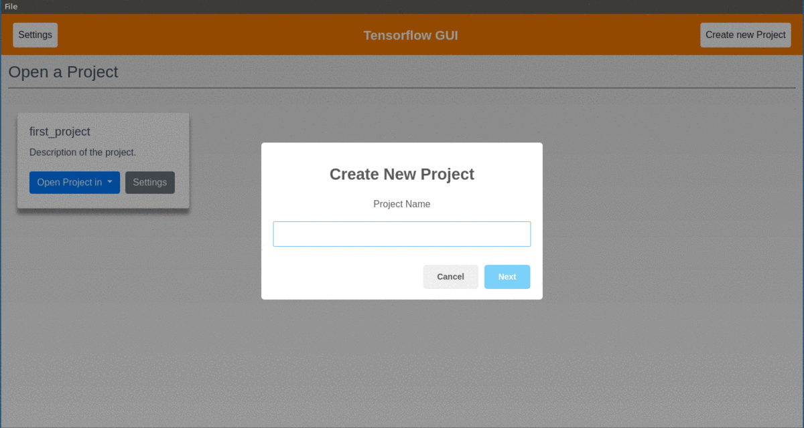

# TensorFlow-GUI
This project aims to develop a TensorFlow compatible GUI to perform all the operations done by TensorFlow.

Student: **Vikas Gola**

Mentors: **Monjoy Saha** (monjoy.saha -at- emory.edu) and **Pooya Mobadersany** (pooya.mobadersany -at- emory.edu)

## Features
1. At present Conv1D, Conv2D, Conv3D, RNN, LSTM, GRU, ConvLSTM2D, CuDNNLSTM, CuDNNGRU, MaxPool1D, MaxPool2D, MaxPool3D, Dropout, AveragePooling1D, AveragePooling2D, AveragePooling3D, ReLU, LeakyReLU, Softmax, Activation, Input, Output, Reshape, RepeatVector, Dense, Flatten, and Embedding layers have been included in the GUI. 

2. Input data (image and csv) pipeline (png to tfrecords) has been developed. 

3. Training and testing pipeline along with result visualization and analysis part is in progress. 

## Installation & Setup
- Clone the repo from GitHub

    `git clone https://github.com/sharmalab/tensorflow-gui`
- Give permission to scripts to install the required libraries
  
    `cd tensorflow-gui/scripts/`

    `chmod +x setup.sh run.sh`
- Run the script to setup and install required libraries

    `./setup.sh`

## How to Run
- Change the directory

    `cd tensorflow-gui/scripts/`
- Start the TensorFlow-GUI

    `./run.sh`
